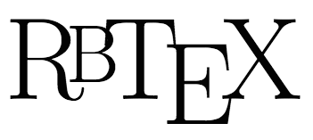

# Capstone
Presenting...  



(Yes, I made that logo, and yes, I know the T overlaps the B. If you don't like it, pull request it
with the fixed logo)

# About this project
I love LaTeX. Seriously, it is the most amazing piece of software to ever be created. But, despite
its Turing completeness, it's just not built for dynamic programming. Sure, there's LuaLaTeX,
but no one really uses Lua, and the Lua standard libraries are very lacking in power. This
project is dedicated to bringing the power of Ruby to LaTeX.  

# Using Tex
RbTeX comes with some useful methods available.  

| Tex. | Description | Implemented? |
| -------- | --------------- | ------ |
| `print`  | prints the provided string to the TeX document | :heavy_check_mark: |
| `imath`  | wraps the provided string in an inline math mode environment| :heavy_check_mark: |
| `cmath`  | wraps the provided string in an equation environment | :heavy_check_mark: |
| `center` | centers the provided line | :heavy_check_mark: |

### Basic examples

```ruby
#print a sentence to the TeX document
Tex.print "\\textbf{THIS IS BOLDED TEXT}"
#print something in math mode
Tex.print (Tex.imath "\\sum_{n=1}^{\\infty}a_{n}p_{n}(x)")
#print a centered equation in math mode
Tex.print (Tex.cmath "L[f]=\\int_{0}^{\\infty}fe^{-st}dt")
Tex.print mtab
#center the table you just created
Tex.print (Tex.center mtab)
```

### Tables
Tables can be created using the builtin `Tex::Table` class. You should pass a square 2D array
```ruby

```

# Using Rbt

In addition, there are several Mathematica-esque modules built into RbTeX that contribute to
the whole "this is really just a calculator" philosophy. All inputs to the `Rbt` module are
formatted as TeX code, and all the functions return TeX code.

| Rbt. | Description | Implemented? |
|------|-------------|--------------|
|`integrate`|preforms integration on the provided TeX styled equation.| :x:|
|`diff`|determines the derivative of the provided function with respect to the provided variable|:x:|
|`dolve`|attempts to solve the differential equation with respect to the provided variable|:x:|
|`polve`|attempts to solve the very basic partial differential equation with repect to the provided array of variables|:x:|
|`truth`|generates a truth table given an expression and a list of variables|:x:|

And here are some use cases:
```ruby
#integrate f(x) = x^2
res = Rbt.integrate "x^{2}", "x"
Tex.print (Tex.cmath res)
#differentiate f(x) = cos(x)
res = Rbt.diff "\\cos{x}", "x"
Tex.print (Tex.cmath "{d\\over dx}\\cos{x}=#{res}")
#solve y''(x) + y(x) = 0
res = Rbt.dolve "y^{''}(x)+y(x)=0", "y", "x"
Tex.print (Tex.cmath "#{res}")
```
